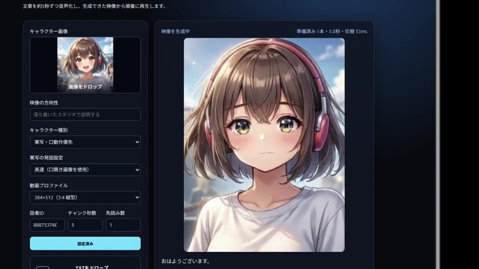

# Realtime Narration Video

[English](README.en.md) | 日本語

> 汎用動画拡散モデルLTXを用いた、ローカル完結可能なフルフレーム会話キャラクターパイプライン。RTX 5090級の検証環境で、送信から先頭動画完成まで最短約2.6秒を実測。

動画下のチャット入力をGemma 4へ送り、ストリーミング応答をAivisSpeechで音声化します。約5秒の音声チャンクをLTX-2.5へ渡し、完成した動画から順次再生する技術検証アプリです。LTXが生成した音声は使用せず、最終MP4には元のTTS音声を差し戻します。

開発中に行った速度・解像度・steps・実写リップシンクの比較は、[改良の経緯と測定記録](docs/development-notes.md)にまとめています。構成、API、パラメータ、運用方法は[テクニカルガイド](docs/technical-guide.md)を参照してください。

## 動作サンプル

[](docs/assets/demo.mp4)

画像をクリックすると、LLMの応答をTTSと動画へ順次変換して再生する約57秒のデモ動画を開きます。直接開く場合は[MP4版（1.8MB）](docs/assets/demo.mp4)をご覧ください。

この動画はGitHub掲載用に圧縮しているため、実際の生成・表示画質よりも若干劣化しています。

## 現在のMVP

- 文・節単位の分割と文単位TTS
- OpenAI互換Gemma 4への会話履歴付きストリーミングチャット
- LLM受信中に確定した文からTTSを並列開始
- 文末・読点を優先し、語尾保護の範囲内で約22〜26文字からTTSを先行する動的動画チャンク
- TTS音声チャンク準備とLTX動画生成のパイプライン処理
- キャラクター画像とTXTファイルのドラッグ＆ドロップ入力
- 貼り付け・キーボード入力・TXTドロップに対応した、LLMを通さない文章朗読
- 日本語・英語のUI切り替えと、自動／日本語／英語の独立した会話言語設定
- 実際のWAV時間を使ったチャンク編成
- LTX-2.5 Audio-to-Video生成
- Realtime Video Studioと同一の16/20/24fps・横型/4:3/縦型プロファイル
- 実写の口固定を避けるため、登録時に生成した発話用アンカーを全チャンクで再参照
- 実写キャラクター登録時にLTXを事前ロードし、選択解像度・8 stepsで口を開いた高品質な発話用アンカーを自動生成
- 元TTS音声への差し替え
- 初期1チャンクで再生開始し、表裏2つのvideo要素で次チャンクを先読み
- 実測LTX生成時間より長い再生バッファを確保する動的開始判定と切替ギャップ表示
- 短い発話も5秒動画として生成し、完成済みなら発話終了後に次へ切替。5秒を超える発話は最終映像フレームを維持して元TTS音声を最後まで再生
- 全動画プロファイルで各ターン先頭を同画角系の低解像度・4 steps、後続を選択解像度・8 stepsで生成
- 実写の発話動作が最も安定したseed 1004を既定値とし、UIから変更して全チャンクへ適用可能
- 実写の高速モードは準備生成だけmodality_scale 1.3、会話ではscaleを外して高速化（口動作優先モードでは会話にも1.3）
- ターン送信時に元キャラクター画像へ戻し、次動画の再生開始まで前ターンの最終フレームを覆う
- ユーザー選択のキャラクター種別で生成方針を切替（標準: scaleなし・指定seedを基準にチャンクごとに変化・ターン内連結、実写優先: modality scale 1.3・指定seed・毎回発話用アンカー）
- Gatewayジョブを100ms間隔で監視
- SSEによる250ms単位の状態更新とLLM/TTS/LTX工程時刻の記録
- Gateway/TTSエラーの表示と永続化

単一GPUでは動画生成が再生時間より遅い場合があります。現段階ではバッファが尽きると次チャンクの完成を待つ準リアルタイム方式です。

## 動作環境の目安

| GPU構成 | 判定 |
|---|---|
| RTX 5090 32GB単騎 + TE（Text Encoder）移設 | ◎ 余裕大（GPU 0：約18GB） |
| 24GB（Blackwell）+ 16GB | ○ 余裕あり（速度は要実測） |
| 16GB（Blackwell）+ 16GB（世代不問） | △ メモリ削減策を全投入して余裕±0GB。擬似検証必須 |
| RTX 4090 24GB | ✕ FP4カーネル非対応（NF4なら動作するが低速） |

上記は本構成でFP4を利用する場合の目安です。実際の使用量と速度は、動画プロファイル、モデル配置、同時稼働プロセスおよびドライバー環境によって変動します。

## 起動

Python 3.11以上、ffmpeg、稼働中のdiffusers-movie-server gateway、AivisSpeech Engineが必要です。

```bash
python3 -m venv .venv
.venv/bin/pip install -e '.[dev]'
cp .env.example .env
PATH="$PWD/.venv/bin:$PATH" ./run.sh
```

ブラウザーで `http://localhost:8782` を開きます。

LLM、Gateway、TTSの接続先は`.env`で設定します。`.env.example`のlocalhost設定を環境に合わせて変更してください。`LLM_MODEL`が空の場合は`/v1/models`から名前に`44b`を含むモデルを優先し、なければ先頭のモデルを自動選択します。

Gatewayはバックエンドを排他的に管理します。8631/8632で管理外のH3/LTXプロセスが起動している場合は、生成受付が409になります。

## API

- `POST /api/sessions` — character/text/concept等をmultipartで送信
- `POST /api/sessions/{id}/messages` — ユーザー発言を送信してストリーミング生成を開始
- `POST /api/sessions/{id}/narrations` — 入力文章をLLMへ送らず直接分割・朗読
- `GET /api/sessions/{id}` — セッションとチャンク状態
- `DELETE /api/sessions/{id}` — 現在チャンク終了後にキャンセル
- `GET /api/sessions/{id}/chunks/{index}/video` — 差し替え済みMP4
- `GET /api/sessions/{id}/chunks/{index}/audio` — 元TTS WAV
- `GET /healthz` — アプリ、Gateway、TTS接続状態

## テスト

```bash
.venv/bin/pytest -q
```

## ライセンス

このリポジトリ内のアプリケーションコードは[Apache License 2.0](LICENSE)で公開しています。

Pythonパッケージ、ffmpeg、AivisSpeech、LTX-2.5、Gemmaなどの依存モジュール、外部サービス、モデル、ウェイトは本ライセンスの対象に含まれません。それぞれの提供元が定めるライセンス、利用規約、配布条件に従ってください。このリポジトリにはモデルおよびモデルウェイトを同梱していません。

### 商用利用について

本プロジェクトを商用利用する場合は、導入事例と利用状況の把握、必要に応じた技術支援のため、[GitHub Issues](https://github.com/animede/Realtime_Narration_Video/issues)からご連絡をお願いします。

この連絡は任意の協力依頼であり、Apache License 2.0が認める商用利用に追加条件を課すものではありません。依存モジュール、モデル、ウェイトおよび外部サービスについては、商用利用が認められているかを各提供元のライセンスと利用規約で別途確認してください。
